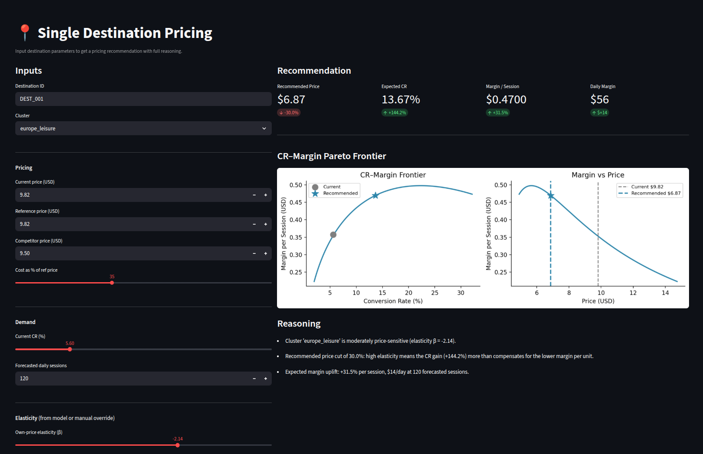
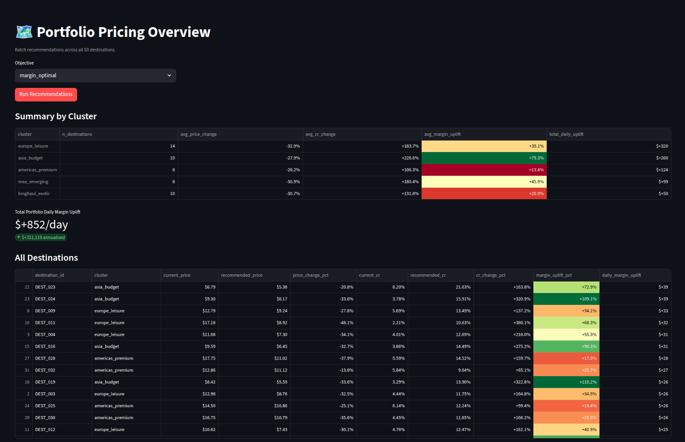
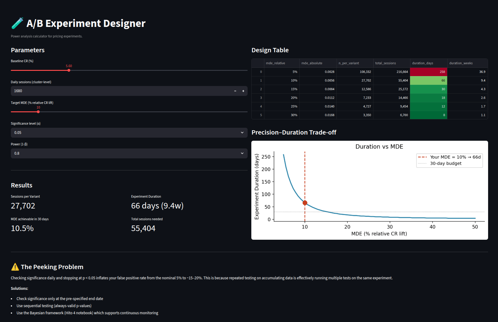

# eSIM Pricing Engine

> **End-to-end pricing data science for travel eSIM products** — from raw transactions to a deployable recommendation engine.

[](https://www.python.org/)
[](LICENSE)

---



---

## The Problem

A traveller lands in a foreign country. They need mobile data. They search, compare, and buy — or don't — within minutes. For a travel eSIM provider, that moment is the entire business.

Pricing this product is genuinely hard:

- **No recurring revenue** — every transaction stands alone. Mispricing costs the full sale.
- **High price visibility** — travellers compare across providers in seconds. Competitive positioning directly affects conversion.
- **Extreme demand heterogeneity** — a budget backpacker in Southeast Asia and a business traveller on the New York–London corridor have fundamentally different willingness to pay. A single global price rule is wrong for both.
- **Strong seasonality** — July demand can be 2× January demand for the same destination. A price that maximises margin in peak season destroys conversion in the trough.

The central tension in any pricing decision is:

> *Lower price → higher conversion rate → more units sold, but less profit per unit.*
> *Higher price → fatter margin per unit, but fewer buyers.*

Resolving this tension rigorously — not by intuition, but by measurement — is what this project is about.

---

## What I Built

A five-component pricing data science system, built end-to-end in Python:

| Component | What it does | Key output |
|-----------|-------------|------------|
| **Data foundation** | Synthetic eSIM market with realistic demand econometrics | 18,250 rows × 50 destinations × 365 days |
| **Elasticity model** | Log-log OLS per destination cluster | β coefficients with 95% CIs, Pareto frontier |
| **Demand forecast** | Global GBM model with time and lag features | MAPE 16%, Test R² 0.84 |
| **A/B framework** | Power analysis, frequentist z-test, Bayesian Beta-Binomial | Experiment duration calculator, P(B>A) |
| **Pricing engine** | Constraint-aware price optimiser + Streamlit UI | Recommended price with reasoning trace |

> **Note on data:** This project uses synthetic data generated from a realistic econometric model (log-log demand, cluster-level elasticities, seasonality, competitive effects). The numbers reported below — elasticities, MAPE, R² — are properties of this synthetic market, not estimates from any real dataset. The value of the project is in the **methodology and tooling**, not in the specific parameter values.

---

## The Modelling Approach

### Why Log-Log Demand?

The core specification is:

```
log(CR) = α_i + β·log(price/ref_price) + γ·log(comp_price/price) + δ·log(seasonality) + ε
```

- **β (own-price elasticity):** our key parameter. β = −2 means a 10% price rise → ~20% CR drop.
- **γ (cross-price elasticity):** competitive effect. Being more expensive than a competitor hurts CR.
- **α_i:** destination fixed effects — absorb all time-invariant destination-level differences.

The log-log form is chosen because it implies *constant elasticity* — a 1% price change produces the same β% CR response regardless of the price level. This is the standard assumption in demand econometrics for digital consumer products and is empirically well-supported in the literature (Tellis 1988, meta-analysis median β ≈ −1.76).

### Model Validation on Synthetic Data

Because the data is synthetic, we know the ground truth elasticity for every destination. This lets us do something impossible with real data: **directly validate how well the model recovers the true parameters.**

<!--  -->

The estimated vs true elasticity scatter clusters tightly around the 45° line (correlation > 0.90), confirming the model specification is correct and the estimation procedure is unbiased. On real data, this step would be replaced by out-of-sample holdout validation and comparison against natural experiments or IV estimates.

### Why Segment-Level Elasticity Matters

Across the five destination clusters in the synthetic market, the seeded elasticities span a range from −1.5 to −3.1. This spread — grounded in the empirical pricing literature on travel and digital goods — illustrates a structural point:

**If elasticity varies by segment (and it does in every real travel market), a uniform global price rule is suboptimal by construction.** It simultaneously overcharges elastic segments (losing conversion) and undercharges inelastic ones (leaving margin on the table). Cluster-aware pricing is not a refinement — it is the correct baseline.

On real data, the first deliverable of this pipeline would be measuring *how large* that spread actually is and which segments are most mis-priced today.

---

## The Pareto Frontier

For each destination, there exists a price that maximises expected margin per session — the product of conversion rate and margin per unit. The Pareto frontier makes this trade-off explicit and visual.



The frontier is the key artefact for a commercial team. It answers the pricing question without requiring them to understand the underlying econometrics: *"here is every achievable (CR, margin) combination — the star marks where you should be."*

The shape varies by segment. A flat right tail means you can push price high without much margin deterioration. A steep drop means the market is elastic and over-pricing is costly. These shapes are qualitatively robust to the exact parameter values — they reflect the structure of the demand function, not just the synthetic numbers.

---

## Demand Forecasting: Why Volume Matters

Elasticity tells you the *rate* — how CR responds to price. But the pricing decision also depends on *volume* — how many sessions you are optimising over.

The same 5% margin improvement at 500 daily sessions (July peak) is worth 2.5× more in absolute terms than at 200 sessions (January trough). A pricing engine that ignores forecast volume will systematically misallocate effort.

The global GBM demand model handles all 50 destinations simultaneously, sharing seasonal patterns across the portfolio. On the synthetic dataset:

- **Test R² = 0.84** on a 60-day temporal holdout
- **Overall MAPE = 16.1%** — within the uncertainty of the elasticity estimates themselves
- Lag features dominate importance: the best predictor of tomorrow's demand is the last 7 and 28 days

The train/test R² gap (0.97 → 0.84) is expected and structural: lag features are perfectly autocorrelated in-sample. The test R² is the honest number.

---

## Experimentation: Closing the Loop

The pricing engine recommends. The A/B framework validates.

Before rolling out any price change to 100% of traffic:

1. **Design**: power analysis determines required sessions and experiment duration
2. **Run**: split traffic 50/50, collect CR data
3. **Evaluate**: frequentist z-test for the binary decision; Bayesian Beta-Binomial for the probability statement

Two findings worth flagging:

**Traffic is the binding constraint.** At individual destination level (~120 sessions/day), detecting a 10% CR lift requires 924 days. The right unit of experimentation is the cluster (~1,680 sessions/day), where the same effect is detectable in 66 days.

**Peeking destroys statistical validity.** Checking significance daily and stopping at p < 0.05 inflates the false positive rate from the nominal 5% to ~20% — empirically demonstrated across 1,000 simulations. In a pricing context, a false positive means rolling out a price change that does not actually improve performance.

---

## The Pricing Engine



The Streamlit app assembles all components into a tool a commercial team can use:

- **Single destination mode**: input any combination of price, elasticity, competitor price, and session forecast — get a recommended price with a Pareto frontier plot and a human-readable reasoning trace
- **Portfolio mode**: one-click batch recommendations across all 50 destinations, ranked by daily margin uplift opportunity
- **Experiment designer**: interactive power analysis calculator — adjust traffic and MDE targets, get experiment duration and design table instantly

The reasoning trace is deliberate. A pricing tool that outputs a number without explanation will not be trusted or adopted. Every recommendation includes: the elasticity regime, competitive context, expected margin uplift, and any active constraints.

---

## Technical Notes

**HC3 robust standard errors** throughout the elasticity models — daily CR variance is heteroskedastic on low-traffic destinations, and HC3 gives honest uncertainty estimates without distributional assumptions.

**Why a global GBM over per-destination Prophet?** With 50 destinations and ~365 observations each, per-destination models overfit on low-volume series. A global model pools seasonal signal across the portfolio and generalises better. Prophet is retained as a single-destination comparison in the notebook.

**Why Bayesian A/B alongside frequentist?** Frequentist tests are the industry default. Bayesian tests give probability statements — *"94% chance the treatment is better"* — which are more actionable for a commercial team making continuous pricing decisions. Both are implemented; the right choice depends on the audience.

---

## Repository Structure

```
esim-pricing-engine/
├── src/
│   ├── data_generation.py   # Synthetic data engine (log-log DGP)
│   ├── elasticity.py        # Log-log OLS, Pareto frontier
│   ├── forecasting.py       # Global GBM demand forecast
│   ├── ab_testing.py        # Power analysis, z-test, Bayesian evaluator
│   └── pricing_engine.py    # Recommendation engine (3 modes)
├── notebooks/
│   ├── 01_eda.ipynb          # Data foundation & EDA
│   ├── 02_elasticity.ipynb   # Elasticity modelling & Pareto frontier
│   ├── 03_forecasting.ipynb  # Demand forecasting & pricing bridge
│   └── 04_ab_testing.ipynb   # A/B framework & peeking problem
├── app/
│   └── streamlit_app.py      # Interactive pricing UI
├── data/
│   └── raw/                  # Regenerate with: make data
├── requirements.txt
└── Makefile
```

---

## Quick Start

```bash
git clone https://github.com/ferariz/esim-pricing-engine.git
cd esim-pricing-engine
python3 -m venv .venv && source .venv/bin/activate
pip install -r requirements.txt
make data                              # generate synthetic dataset
streamlit run app/streamlit_app.py    # launch pricing engine
```

To run the notebooks:
```bash
jupyter lab notebooks/
```

---

## About

A complete pricing data science system for travel eSIM products — elasticity modelling, demand forecasting, A/B experimentation, and a recommendation engine.

**Fernando Arizmendi** — [GitHub](https://github.com/ferariz) · [LinkedIn](https://www.linkedin.com/in/fernando-arizmendi/) · [arizmendi.f@gmail.com](mailto:arizmendi.f@gmail.com)
